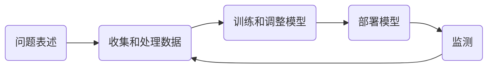

## 1 Data Collection

### 1.1 概述

slides: https://c.d2l.ai/stanford-cs329p/_static/pdfs/cs329p_slides_1_2.pdf

**机器学习的工作流程**

**工业上机器学习的应用**

* 制造业：质量控制、预测性维护
* 零售业：推荐系统、聊天机器人、需求预测
* 医疗：实时的患者数据、疾病识别和预警
* 金融：欺诈检测、申请处理
* 汽车：故障检测、自动驾驶

**机器学习面临的挑战**

* 制定问题：关注最具影响力的工业问题
* 数据：高质量数据稀缺，隐私问题
* 训练模型：机器学习模型越来越复杂、需要大量数据并且成本高昂
* 模型部署：大量的计算不适合实时推理
* 监测：数据分布变化、公平性问题

**机器学习中的角色**

* 领域专家：拥有业务洞察力，了解哪些数据很重要以及在哪里可以找到它，确定机器学习模型的真正影响
* 数据科学家：全栈数据挖掘、模型训练和部署
* 机器学习专家：设计 SOTA 机器学习模型
* 软件开发工程师：开发/维护数据、模型训练和服务管道

### 1.2 数据采集

slides: https://c.d2l.ai/stanford-cs329p/_static/pdfs/cs329p_slides_1_3.pdf

**数据采集流程**

**发现哪些数据可用**

* 识别现有数据集
* 查找基准数据集以评估新想法
  * e.g. 用于新超参数调整算法的一组不同的中小型数据集
  * e.g. 非常大的深度神经网络所使用的大规模数据集

**流行的机器学习数据集**

* MNIST
* ImageNet
* AudioSet
* LibriSpeech
* Kinetics
* KITTI
* Amazon Review
* SQuAD

**数据采集流程图**

**生成数据**

**summary**

* 找到合适的数据集非常困难
* 工业环境的原始数据 VS 学术数据集
* 数据集成将来自多个来源的数据结合在一起
* 数据增强是一种常见做法
* 合成数据越来越流行

### 1.3 网络爬虫

slides: https://c.d2l.ai/stanford-cs329p/_static/pdfs/cs329p_slides_2_1.pdf

* 当网站不提供数据 API，网络爬虫是一种强大的大规模收集数据的方式
* 公共云的成本低
* 使用浏览器的检查工具定位 HTML 中的信息
* 谨慎使用，需要考虑法律风险

### 1.4 数据标注

slides: https://c.d2l.ai/stanford-cs329p/_static/pdfs/cs329p_slides_1_5.pdf

**难点**

## 2 Data Preprocessing

### 2.1 探索性数据分析

slides: https://c.d2l.ai/stanford-cs329p/_static/notebooks/cs329p_notebook_eda.slides.html

### 2.2 数据清理

slides: https://c.d2l.ai/stanford-cs329p/_static/pdfs/cs329p_slides_3_1.pdf

**数据错误**

* 数据总是有一些错误

* 一个好的机器学习模型对错误的容忍度很高
  * 训练会收敛，但是正确率会比较低
* 

**数据错误的类型**

* 数据不在正确的分布内
* 违反数据规则
* 数据格式错误

### 2.3 数据交换

slides: https://c.d2l.ai/stanford-cs329p/_static/pdfs/cs329p_slides_3_2.pdf

### 2.4 特征工程

slides: https://c.d2l.ai/stanford-cs329p/_static/pdfs/cs329p_slides_3_3.pdf

### 2.5 数据科学家的日常

slides: 

## 3 ML model recap

### 3.1 机器学习介绍

slides: https://c.d2l.ai/stanford-cs329p/_static/pdfs/cs329p_slides_4_1.pdf

### 3.2 决策树

slides: https://c.d2l.ai/stanford-cs329p/_static/pdfs/cs329p_slides_4_2.pdf

### 3.3 线性模型

slides: https://c.d2l.ai/stanford-cs329p/_static/pdfs/cs329p_slides_4_3.pdf

### 3.4 随机梯度下降

slides: https://c.d2l.ai/stanford-cs329p/_static/pdfs/cs329p_slides_4_3.pdf

### 3.5 多层感知机

slides: https://c.d2l.ai/stanford-cs329p/_static/pdfs/cs329p_slides_5_1.pdf

### 3.6 卷积神经网络

slides: https://c.d2l.ai/stanford-cs329p/_static/pdfs/cs329p_slides_5_1.pdf

### 3.7 循环神经网络

slides: https://c.d2l.ai/stanford-cs329p/_static/pdfs/cs329p_slides_5_1.pdf

## 4 Model Validation

### 4.1 模型估计

slides: https://c.d2l.ai/stanford-cs329p/_static/pdfs/cs329p_slides_6_1.pdf

### 4.2 过拟合和欠拟合

slides: https://c.d2l.ai/stanford-cs329p/_static/pdfs/cs329p_slides_6_2.pdf

### 4.3 模型验证

slides: https://c.d2l.ai/stanford-cs329p/_static/pdfs/cs329p_slides_6_3.pdf	

## 5 Model Combination

### 5.1 方差和偏差

slides: https://c.d2l.ai/stanford-cs329p/_static/pdfs/cs329p_slides_7_1.pdf

### 5.2 Bagging

slides: https://c.d2l.ai/stanford-cs329p/_static/pdfs/cs329p_slides_7_2.pdf

### 5.3 Boosting

slides: https://c.d2l.ai/stanford-cs329p/_static/pdfs/cs329p_slides_7_3.pdf

### 5.4 Stacking

slides: https://c.d2l.ai/stanford-cs329p/_static/pdfs/cs329p_slides_7_4.pdf

## 6 Covariate Shift

## 7 Label Shift

## 8 Data beyond IID

## 9 Model Tuning

### 9.1 Model Tuning

slides: https://c.d2l.ai/stanford-cs329p/_static/pdfs/cs329p_slides_12_1.pdf

### 9.2 HPO algorithms

slides: https://c.d2l.ai/stanford-cs329p/_static/pdfs/cs329p_slides_12_2.pdf

### 9.3 NAS algorithms

slides: https://c.d2l.ai/stanford-cs329p/_static/pdfs/cs329p_slides_12_3.pdf

## 10 Deep Network Tuning

## 11 Transfer Learning

## 12 Distillation

## 13 Multimodal data

## 14 Model Deployment

## 15 Fairness (Criteria)

## 16 Fairness (Fixes) and Explainability

## 17 Guest Lecture

## 18 Guest Lecture

## References

[Practical Machine Learning](https://c.d2l.ai/stanford-cs329p/index.html)

[斯坦福2021秋：实用机器学习](https://space.bilibili.com/1567748478/channel/seriesdetail?sid=358496)
