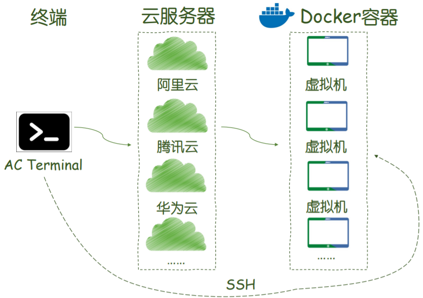

# Linux基础课

1 常用文件管理命令

https://www.acwing.com/file_system/file/content/whole/index/content/2855530/

2 tmux和vim

https://www.acwing.com/file_system/file/content/whole/index/content/2855620/

3 shell语法

https://www.acwing.com/file_system/file/content/whole/index/content/2855883/

4 ssh

[4 ssh.md](./4 ssh.md)

https://www.acwing.com/file_system/file/content/whole/index/content/2897078/

5 git

[5 git.md](./5 git.md)

https://www.acwing.com/file_system/file/content/whole/index/content/2932078/

6 thrift

[6 thrift.md](./6 thrift.md)

https://www.acwing.com/file_system/file/content/whole/index/content/2991899/

7 管道、环境变量与常用命令

https://www.acwing.com/file_system/file/content/whole/index/content/3030391/

8 租云服务器及配docker环境

[8 docker.md](./8 docker.md)

https://www.acwing.com/file_system/file/content/whole/index/content/3074146/

