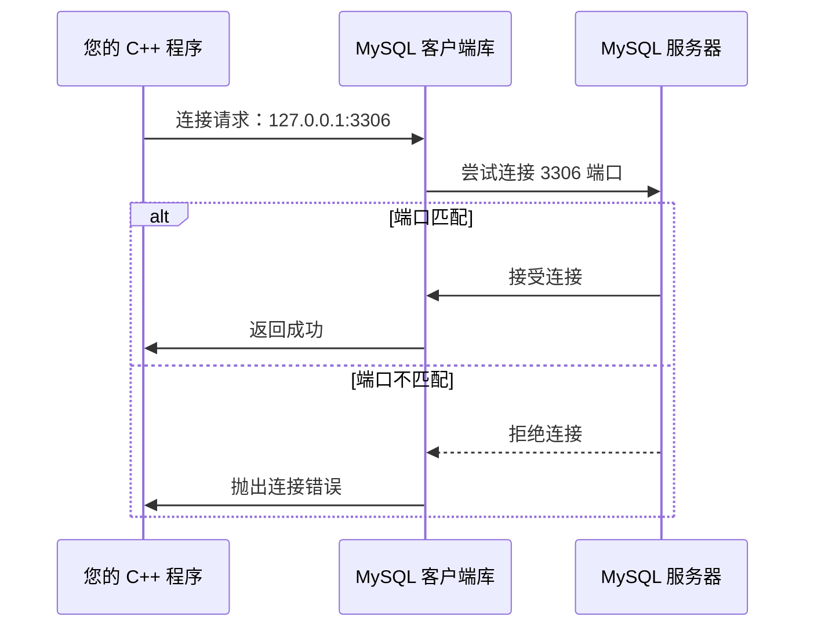

# MySQL

## 安装和配置 MySQL

步骤1：安装 MySQL

```bash
sudo apt install mysql-server
```

步骤2：启动 MySQL 服务

```bash
sudo service mysql start
```

步骤3：安全初始化 MySQL

```bash
sudo mysql_secure_installation
```

按提示操作：

1.  设置 root 密码（重要！）
2.  移除匿名用户（选 `Y`）
3.  禁止 root 远程登录（选 `Y`）
4.  删除测试数据库（选 `Y`）
5.  重新加载权限表（选 `Y`）

步骤4：登录 MySQL 并创建数据库

```bash
sudo mysql -u root -p
```

```sql
-- 创建 WebServer 专用数据库
CREATE DATABASE WebServer_DB;

-- 创建专用用户（替换 'password' 为弱/中/强密码）
CREATE USER 'webserver_user'@'localhost' IDENTIFIED BY 'password';

-- 授予用户对数据库的完整权限
GRANT ALL PRIVILEGES ON WebServer_DB.* TO 'webserver_user'@'localhost';

-- 刷新权限
FLUSH PRIVILEGES;

-- 创建user表
USE WebServer_DB;
CREATE TABLE user(
    username char(50) NULL,
    password char(50) NULL
)ENGINE=InnoDB;

-- 添加数据
INSERT INTO user(username, password) VALUES('name', 'password');

-- 退出
EXIT;
```

步骤5：安装 C++ 连接 MySQL 的驱动

安装 MySQL C++ Connector：

```bash
# Ubuntu/Debian
sudo apt install libmysqlcppconn-dev
```

步骤6：验证安装：

```c++
#include <cppconn/driver.h>
#include <cppconn/exception.h>
#include <cppconn/resultset.h>
#include <cppconn/statement.h>

int main() {
    try {
        sql::Driver *driver = get_driver_instance();
        sql::Connection *con = driver->connect("tcp://127.0.0.1:3306", "webserver_user", "password");
        con->setSchema("WebServer_DB");
        std::cout << "MySQL 连接成功！" << std::endl;
        delete con;
    } catch (sql::SQLException &e) {
        std::cerr << "MySQL 错误: " << e.what() << std::endl;
    }
    return 0;
}
```

其中端口号 3306 是 MySQL 服务器默认的。



编译指令：

```bash
g++ test.cpp -lmysqlcppconn -o mysql_test && ./mysql_test
```


### 其他问题

1.   查看 MySQL 使用的端口号：
     ```sql
     SHOW GLOBAL VARIABLES LIKE 'port';
     ```

2.   [2025最新版VS2022配置C++ connector连接mysql(保姆级教学)](https://blog.csdn.net/weixin_74027669/article/details/137203874)

3.   


## MySQL 基础语法

登录数据库：

```bash
sudo mysql -u root -p
```

显示数据库列表：

```sql
SHOW DATABASES;
```

打开数据库：

```sql
USE WebServer_DB;
```

显示WebServer_DB中的所有表：

```sql
SHOW TABLES;
```

显示user表的结构：

```sql
DESCRIBE user;
```

显示user表中的所有记录：

```sql
SELECT * FROM user;
```

删除user表中的指定记录：

```sql
DELETE FROM user WHERE username = 'Alice';
DELETE FROM user WHERE username = 'Alice' AND password = 'Alice_password';
DELETE FROM user;
```


```sql
```


B+树

write ahead log (WAL)


## 参考资料

【Mysql是什么？架构是怎么样的？】 https://www.bilibili.com/video/BV1p5qhYsE4f/?share_source=copy_web&vd_source=b5ed364998fc1b958c57abd6dbda38e3