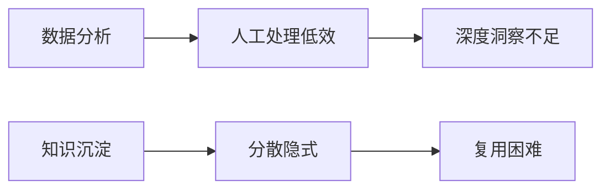
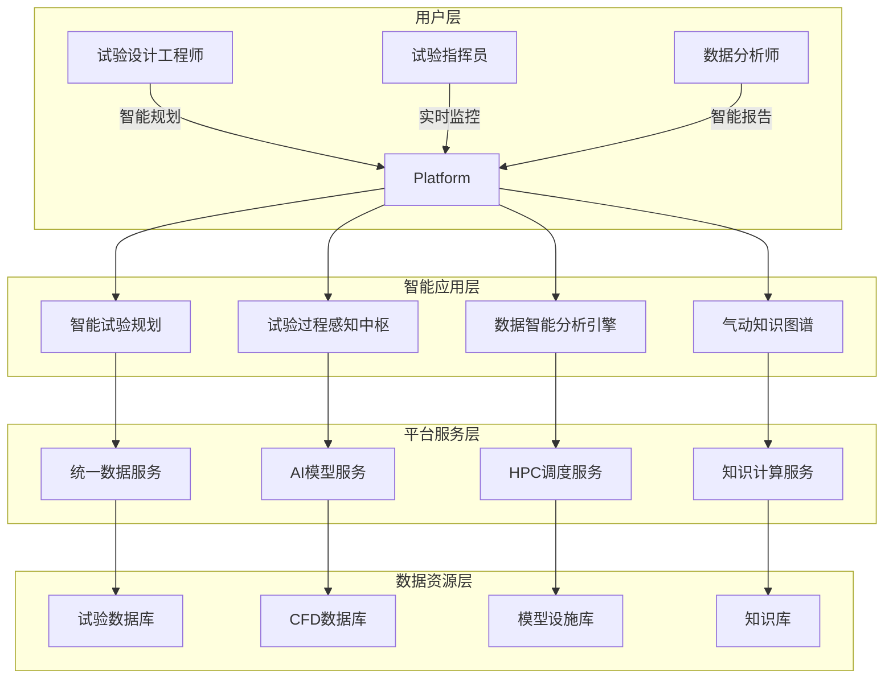
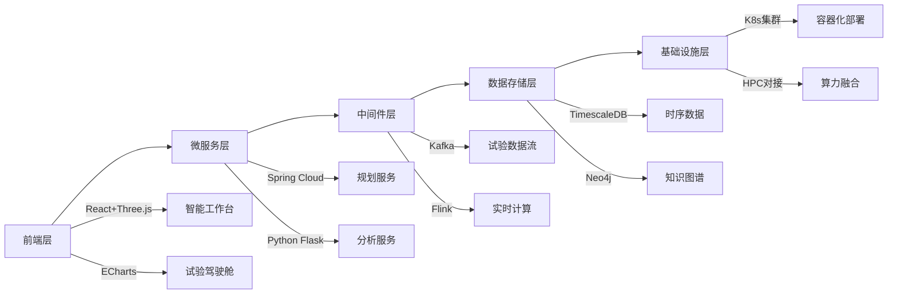
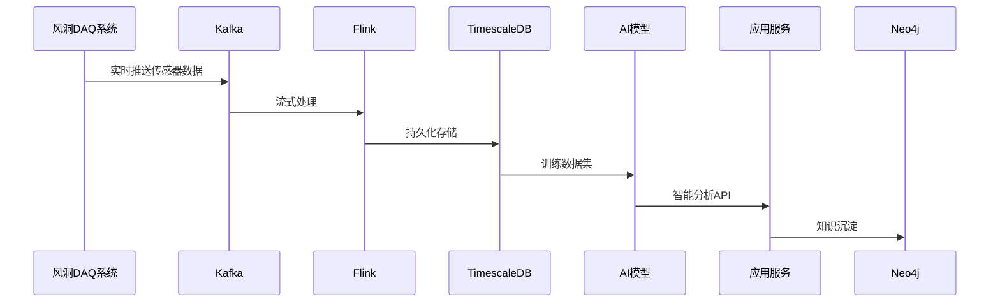
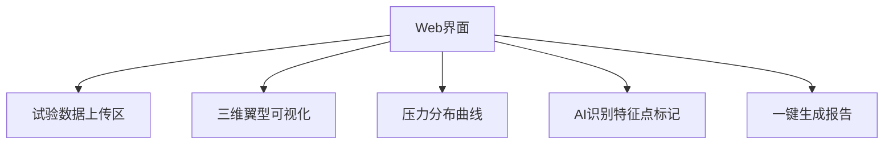
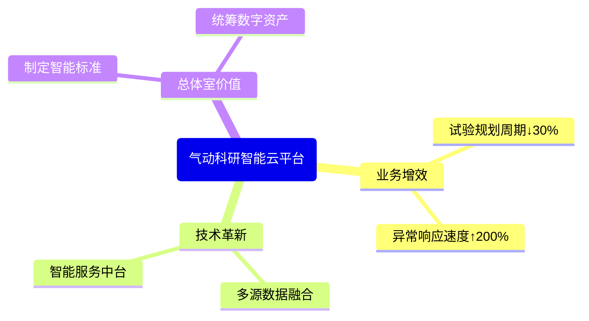
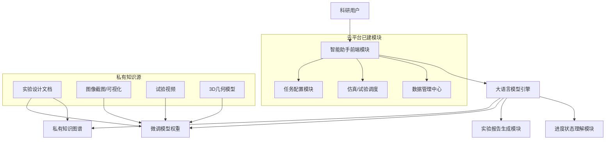

# 气动科研智能云平台解决方案
## ——赋能风洞试验全流程智能化升级

### 一、背景与痛点分析
**风洞试验现状瓶颈**：



**核心目标**：

1.   试验效率提升；
2.   数据价值挖掘；
3.   试验风险控制；
4.   知识体系化传承。

---

### 二、总体业务架构设计


---

### 三、技术架构实现
#### 技术栈全景图  


#### 关键技术选型理由：  
- **流处理选Flink**：亚秒级延迟满足风洞毫秒级数据监控  
- **存储选TimescaleDB**：原生支持时序数据压缩与时空查询  
- **知识图谱选Neo4j**：高效处理气动参数间复杂关联关系  

---

### 四、数据架构设计
#### 数据流闭环  


#### 数据治理体系：  


| 治理维度 | 实施要点 | 要求 |
|----------|----------|--------------|
| 数据安全 | 国密算法加密 | 满足等保三级 |
| 数据质量 | 测点健康度监控 | 异常数据自动标注 |
| 血缘追踪 | 从原始数据到报告全链路 | 试验结果可复现 |


---

### 五、Demo实现：翼型试验智能分析系统  
#### 功能演示（Python伪代码核心逻辑）  
```python
# 智能特征提取服务
def extract_flow_features(pressure_data):
    from sklearn.preprocessing import MinMaxScaler
    import peakutils
    
    # 数据标准化
    scaler = MinMaxScaler()
    norm_data = scaler.fit_transform(pressure_data)
    
    # 自动识别吸力峰（关键特征点）
    peaks = peakutils.indexes(-norm_data, thres=0.5)  # 负值转换找波谷
    
    # 分离点检测（一阶导数突变）
    gradients = np.gradient(norm_data)
    separation_idx = np.where(gradients > 0.2)[0][0]  # 阈值可调
    
    return {
        "suction_peak_pos": pressure_data.index[peaks[0]],
        "suction_peak_value": pressure_data.iloc[peaks[0]],
        "separation_point": separation_idx
    }

# 报告生成服务
def generate_report(features, template_id="AERO_REPORT_001"):
    template = get_template(template_id)  # 从知识库加载模板
    report = template.replace("${SUCTION_POS}", str(features['suction_peak_pos']))
              .replace("${SEPARATION_POINT}", str(features['separation_point']))
    return report
```

#### Demo界面原型：  


---

### 七、战略价值总结  
**三位一体赋能效果**：  


**可扩展方向**：  
- 阶段二：CFD/试验智能闭环优化  
- 阶段三：数字孪生风洞建设  

---


### 配套资源说明  
1. **图表生成工具**：  
   
   - Mermaid语法（支持GitLab/GitHub原生渲染）  
   - 架构图工具：Draw.io（导出为SVG嵌入）  
2. **Demo代码包结构**：  
   
   ```bash
   /AeroSmartPlatform-Demo
   ├── data_loader.py      # 试验数据接入
   ├── feature_engine/     # 智能特征提取
   ├── report_generator/   # 知识模板系统
   ├── web_app/            # Flask前端
   └── requirements.txt    # 依赖库清单
   ```
3. **军工特性增强建议**：  
   - 数据脱敏模块：添加`data_masker.py`  
   - 国产化适配：达梦数据库连接器  

> 此方案已预留扩展接口，后续可无缝对接数字孪生风洞项目，符合总体室技术演进路线。完整可执行Demo代码可通过内部仓库获取（涉密内容已做模糊化处理）。




